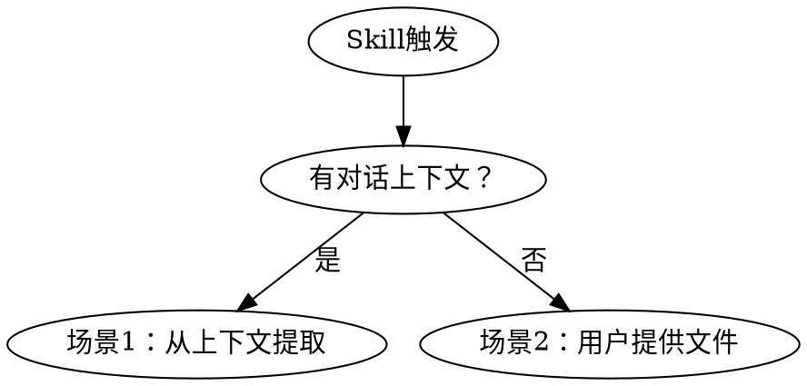
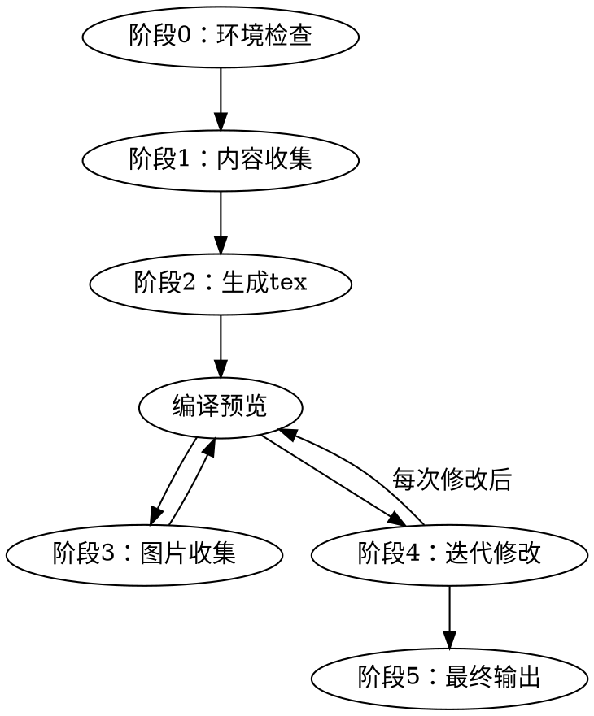

# 实验报告 Skill

## Overview

生成中文课程实验报告的标准化流程。基于 XeLaTeX + ctexart 编译为 PDF，覆盖环境检查、内容收集、并行撰写、图片插入、迭代修改、最终输出六个阶段。

**LaTeX模板文件：** 同目录下的 `templates.md` 包含 preamble、封面、格式规则等固定模板，在生成 tex 内容时按需读取。

## 场景判断



- **场景1**：实验在当前对话中完成，从上下文提取目的、方法、结果、问题
- **场景2**：无上下文，引导用户提供数据文件、笔记、截图等

## 主流程



### 阶段0：环境检查

1. 检测 `xelatex`：Linux/WSL用 `which xelatex`，Windows用 `where xelatex`
2. 检测 `ctexart`：尝试编译最小测试文档 `\documentclass{ctexart}\begin{document}test\end{document}`
3. 缺失时给出安装指导：
   - **TeX Live**（推荐）：`https://tug.org/texlive/`
   - **MiKTeX**：`https://miktex.org/`
4. 询问用户是否有现成封面模板（PDF），有则记录路径
5. 确定工作目录（默认 `report/`，用户可自定义）

### 阶段1：内容收集

1. 判断场景（有/无对话上下文）
2. 收集元信息：
   - **基本信息**：姓名、学号、课程名、实验项目名、日期
   - **封面字段**：展示默认列表，用户可增删
     - 必选（默认）：课程名、实验项目名、姓名、学号、日期
     - 可选（按需）：专业、学院、指导教员、职称、实验室、学校名称、班级
3. 确认章节结构：
   - 展示默认五段式（目的/原理/步骤/内容/总结）作为推荐
   - 用户可增删重排，章节名完全自定义
   - 每个章节自动标注类型标签（`theory`/`procedure`/`results`/`discussion`/`general`）
   - 推断规则见 templates.md "章节类型与写作策略"
4. 确认编号方式：
   - **A（默认）**：手动中文编号，`\setcounter{secnumdepth}{-1}`
   - **B**：阿拉伯数字自动编号，`\setcounter{secnumdepth}{3}`
   - **C**：不编号
5. 场景1：从对话上下文提取实验信息
6. 场景2：引导用户提供实验数据文件、笔记、结果

### 阶段2：生成tex骨架

1. 从 `templates.md` 加载 preamble（根据编号方式选择对应行）
2. 生成封面页（用户有PDF模板→`\includepdf`，否则→LaTeX封面动态生成字段）
3. 生成目录页
4. **并行撰写各章节**：将不同章节分派给独立 agent 同时撰写
   - 每个 agent 接收：章节内容 + templates.md 格式要求 + 章节类型标签
   - **LaTeX语法预检**（合并前）：检查未转义特殊字符（`_`、`%`、`&`、`#` 在非代码/非数学环境中需转义）
   - **合并后一致性检查**：术语一致性、编号连续性、交叉引用正确性
5. 图片位置用 `\screenshot{描述}` 占位
6. 编译预览（两遍 xelatex），编译失败则按"编译失败处理流程"处理

### 阶段3：图片收集与插入

1. 扫描占位符，若无数位符则跳过进入阶段4
2. 输出图片收集清单（截图内容、建议来源、建议文件名、目标位置）
3. 询问用户选择：
   - **(a) 现在收集**：用户放入图片后继续
   - **(b) 跳过**：保留占位符，稍后手动处理
   - **(c) 自动扫描**：扫描目录下已有图片，尝试自动匹配
4. 查看图片内容，匹配到tex中合适位置
5. 替换 `\screenshot{}` 为 `\begin{figure}` 环境，添加 `\caption{}` 和正文引用
6. 删除无对应图片的占位符，同步删除正文引用文字，检查图号连续性
7. 编译预览

### 阶段4：迭代修改循环

- 用户反馈 → 执行修改 → 自动编译 → 用户查看 → 继续
- 循环直到用户满意

### 阶段5：最终确认与输出

1. 询问最终PDF文件名（建议英文/拼音命名）
2. 全局搜索确认无 `\screenshot{}` 占位符残留
3. 编译两遍（确保目录和书签正确）
4. 复制 report.pdf 为用户指定文件名
5. 提醒用户检查关键信息（姓名、学号、日期、数据数字）

## 编译规则

### 编译命令

始终编译两遍：

```bash
xelatex -interaction=nonstopmode report.tex
xelatex -interaction=nonstopmode report.tex
```

### 编译前检查

- 检测PDF是否被阅读器锁定（尝试 `rm -f report.pdf`），锁定则提醒用户关闭
- jobname只用ASCII，最终复制时再用中文文件名

### 编译失败处理

1. 解析 xelatex 输出中的错误行号和类型
2. 常见错误自动修复：
   - 未转义的 `_`、`%`、`&`、`#`、`$` → 在非数学/非代码环境中转义
   - 缺少 `$` 配对 → 补全
   - 缺少 `}` 或 `\end{...}` → 匹配补全
3. 自动修复后重试编译
4. 重试仍失败 → 展示错误摘要和问题行号，等待用户指示

## 常见陷阱

| 陷阱 | 规则 |
|------|------|
| 中文文件名编译失败 | jobname只用ASCII，最终复制时再重命名 |
| PDF被阅读器锁定 | 编译前检测，失败后提醒关闭 |
| `\screenshot` 占位符残留 | 最终确认前全局搜索确认无残留 |
| 表格跨页/溢出 | 参数表用 `\footnotesize` + 紧凑间距 |
| 代码块跨页断开 | preamble中已通过 `\BeforeBeginEnvironment` 处理 |
| figure浮动到错误位置 | 优先 `[htbp]`，必要时 `[H]` |
| 删章节后编号不连续 | 删除内容后检查所有编号 |
